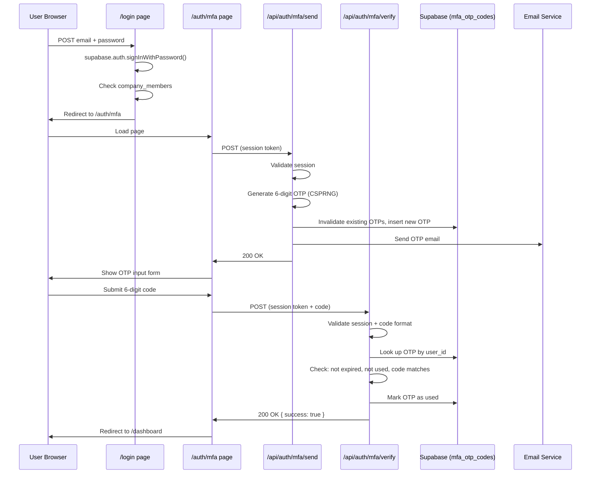

# Design Document: Email OTP MFA

## Overview

This document describes the technical design for adding Email OTP-based Multi-Factor Authentication (MFA) to the SaaSient user dashboard login flow. After a user authenticates with email and password, a 6-digit one-time passcode is generated server-side, stored in Supabase, and emailed to the user. The user must enter the correct, non-expired code on a dedicated `/auth/mfa` verification page to gain access to the dashboard.

The feature is scoped to the user dashboard login only (not the admin login). It is a **custom** MFA implementation layered on top of Supabase's existing `aal1` session — it does not use Supabase's native TOTP/aal2 MFA enrollment system.

### Key Design Decisions

**MFA pending state communication**: The existing login page already checks `aal?.nextLevel === 'aal2'` and redirects to `/auth/mfa`. Since this feature uses a custom OTP flow (not Supabase's native aal2), the login page will redirect to `/auth/mfa` immediately after a successful password authentication + company membership check, without relying on the aal2 check. The "MFA pending" state is communicated implicitly: the user holds a valid `aal1` Supabase session. The `/auth/mfa` page reads this session to identify the user and call the send/verify API routes. No additional cookie or localStorage flag is needed — the Supabase session cookie itself is the signal.

**No aal2 elevation**: Supabase's native aal2 elevation requires enrolling a TOTP authenticator. Since this is a custom email OTP flow, the session remains at `aal1` throughout. The dashboard guard will check for a valid session (aal1 is sufficient) combined with a server-side flag or simply trust that the `/auth/mfa` page was completed. To prevent bypass, the `/auth/mfa` page will call `/api/auth/mfa/send` on mount (if no OTP has been sent yet), and the dashboard will remain protected by the existing Supabase session guard.

**Rate limiting**: Verification attempt rate limiting is implemented server-side in the API route using an in-memory store (keyed by `user_id`). Resend rate limiting is also server-side. Client-side `RateLimiter` from `lib/security.ts` is used as a secondary UX guard only.

---

## Architecture



### Component Overview

```
app/
  login/page.tsx              — Modified: redirect to /auth/mfa after password auth
  auth/
    mfa/page.tsx              — New: OTP verification page
  api/
    auth/
      mfa/
        send/route.ts         — New: POST endpoint to generate + send OTP
        verify/route.ts       — New: POST endpoint to verify OTP

lib/
  otp.ts                      — New: OTP generation, validation, rate-limit helpers
```

---

## Components and Interfaces

### API Route: `POST /api/auth/mfa/send`

**Request**
```
Authorization: Bearer <supabase-access-token>
Content-Type: application/json
(no body required)
```

**Response — Success (200)**
```json
{ "success": true }
```

**Response — Unauthorized (401)**
```json
{ "error": "Unauthorized" }
```

**Response — Email send failure (500)**
```json
{ "error": "Failed to send OTP email. Please try again." }
```

**Response — Resend rate limited (429)**
```json
{ "error": "Too many resend requests. Please wait before trying again." }
```

**Logic**
1. Extract and validate the Bearer token using `supabaseAdmin.auth.getUser(token)`.
2. Check resend rate limit for `user_id` (max 3 per 10-minute window).
3. Invalidate any existing unexpired, unused OTPs for the user (`UPDATE mfa_otp_codes SET used = true WHERE user_id = $1 AND used = false AND expires_at > now()`).
4. Generate a 6-digit OTP using `crypto.randomInt(0, 1_000_000)`, zero-padded to 6 digits.
5. Insert a new record into `mfa_otp_codes`.
6. Send the OTP email via Supabase's built-in email service.
7. If email send fails, return 500 (do not redirect).

---

### API Route: `POST /api/auth/mfa/verify`

**Request**
```
Authorization: Bearer <supabase-access-token>
Content-Type: application/json
{ "code": "123456" }
```

**Response — Success (200)**
```json
{ "success": true }
```

**Response — Invalid/expired code (200 with failure flag)**
```json
{ "success": false, "error": "Invalid or expired code. Please try again." }
```

**Response — Rate limited (429)**
```json
{ "error": "Too many attempts. Please request a new code." }
```

**Response — Bad request (400)**
```json
{ "error": "Code must be exactly 6 digits." }
```

**Response — Unauthorized (401)**
```json
{ "error": "Unauthorized" }
```

**Logic**
1. Extract and validate the Bearer token.
2. Validate `code` is exactly 6 decimal digits — return 400 if not.
3. Check verification attempt rate limit for `user_id` (max 5 per 10-minute window) — return 429 if exceeded.
4. Query `mfa_otp_codes` for the most recent record matching `user_id`, `used = false`, `expires_at > now()`.
5. Compare submitted code to stored code using constant-time comparison.
6. If match: mark OTP as `used = true`, reset rate-limit counter, return `{ success: true }`.
7. If no match or no valid OTP found: increment attempt counter, return `{ success: false, error: "..." }`.

---

### Page: `/auth/mfa`

A new Next.js client page that:
- On mount: reads the Supabase session. If no session, redirects to `/login`. If session exists and a "verified" flag is set in sessionStorage, redirects to `/dashboard`.
- On mount (if session valid): calls `POST /api/auth/mfa/send` to trigger OTP generation and delivery (idempotent — the send endpoint handles invalidating old OTPs).
- Renders the `AuthLayout` + `GlowCard` + `AuthForm` shell consistent with the existing auth pages.
- Displays a 6-digit OTP input (numeric only, max length 6).
- Displays a "Resend code" button with a cooldown timer.
- On submit: calls `POST /api/auth/mfa/verify`. On success, sets a `sessionStorage` flag and redirects to `/dashboard`.
- Displays appropriate error messages inline.

---

### Modified Page: `/login`

The existing `onSubmit` handler currently checks `aal?.nextLevel === 'aal2'` and redirects to `/auth/mfa`. This check will be **replaced** with an unconditional redirect to `/auth/mfa` after successful password authentication and company membership verification. The aal2 check is removed because this feature uses a custom OTP flow, not Supabase's native TOTP enrollment.

```typescript
// Before (existing):
if (aal?.nextLevel === 'aal2') {
  router.replace('/auth/mfa');
  return;
}
router.replace('/dashboard');

// After (new):
// Always redirect to MFA verification after successful password auth
router.replace('/auth/mfa');
```

The `useEffect` session guard at the top of the login page also needs updating: if a session exists at `aal1`, redirect to `/auth/mfa` (not `/dashboard`), since the user still needs to complete OTP verification.

---

### Library: `lib/otp.ts`

Exports pure utility functions used by the API routes:

```typescript
// Generate a cryptographically secure 6-digit OTP string (zero-padded)
export function generateOtp(): string

// Validate that a string is exactly 6 decimal digits
export function isValidOtpFormat(code: string): boolean

// Server-side in-memory rate limiter (keyed by user_id)
export class ServerRateLimiter {
  constructor(maxAttempts: number, windowMs: number)
  canAttempt(userId: string): boolean
  reset(userId: string): void
}
```

---

## Data Models

### Database Table: `mfa_otp_codes`

```sql
CREATE TABLE mfa_otp_codes (
  id          UUID PRIMARY KEY DEFAULT gen_random_uuid(),
  user_id     UUID NOT NULL REFERENCES auth.users(id) ON DELETE CASCADE,
  code        TEXT NOT NULL,           -- 6-digit zero-padded string
  expires_at  TIMESTAMPTZ NOT NULL,    -- created_at + 10 minutes
  used        BOOLEAN NOT NULL DEFAULT FALSE,
  created_at  TIMESTAMPTZ NOT NULL DEFAULT NOW()
);

-- Index for fast lookup by user_id
CREATE INDEX idx_mfa_otp_codes_user_id ON mfa_otp_codes(user_id);

-- Row Level Security: deny all direct client access (admin client only)
ALTER TABLE mfa_otp_codes ENABLE ROW LEVEL SECURITY;
-- No RLS policies granted — all access via service role key
```

**Field descriptions**

| Field | Type | Description |
|---|---|---|
| `id` | UUID | Primary key, auto-generated |
| `user_id` | UUID | FK to `auth.users.id` |
| `code` | TEXT | 6-digit zero-padded OTP string |
| `expires_at` | TIMESTAMPTZ | Exactly 10 minutes after `created_at` |
| `used` | BOOLEAN | `false` on creation, `true` after successful verification or invalidation |
| `created_at` | TIMESTAMPTZ | Record creation timestamp |

### TypeScript Type

```typescript
interface MfaOtpRecord {
  id: string;
  user_id: string;
  code: string;
  expires_at: string;   // ISO 8601
  used: boolean;
  created_at: string;   // ISO 8601
}
```

### Server-Side Rate Limit Store

An in-memory `Map<string, number[]>` keyed by `user_id`, storing timestamps of recent attempts. Two separate instances are used: one for verification attempts (max 5 / 10 min) and one for resend requests (max 3 / 10 min). These are module-level singletons in `lib/otp.ts`.

> Note: In-memory rate limiting resets on server restart. For production hardening, this could be moved to a Redis store or a Supabase table, but in-memory is sufficient for the current scale.

---

## Correctness Properties

*A property is a characteristic or behavior that should hold true across all valid executions of a system — essentially, a formal statement about what the system should do. Properties serve as the bridge between human-readable specifications and machine-verifiable correctness guarantees.*

### Property 1: OTP expiry offset is always exactly 10 minutes

*For any* OTP creation timestamp, the `expires_at` value stored in the OTP record shall equal the creation time plus exactly 600 seconds (10 minutes).

**Validates: Requirements 1.2**

---

### Property 2: OTP format invariant

*For any* call to `generateOtp()`, the returned string shall be exactly 6 characters long, consist entirely of decimal digit characters (`0`–`9`), and represent a value in the range `[0, 999999]`.

**Validates: Requirements 1.6**

---

### Property 3: OTP user association round-trip

*For any* `user_id`, when an OTP is generated and stored for that user, the `user_id` field of the resulting `mfa_otp_codes` record shall equal the input `user_id`.

**Validates: Requirements 1.4**

---

### Property 4: Previous OTPs are invalidated on new generation

*For any* user with any number of existing unexpired, unused OTP records, after a new OTP is generated for that user, all previously existing OTP records for that user shall have `used = true`.

**Validates: Requirements 2.2, 5.2**

---

### Property 5: Valid OTP verification marks it as used

*For any* valid (unexpired, unused, correctly formatted) OTP record, submitting the correct code to the verify endpoint shall result in that OTP record having `used = true` and a success response.

**Validates: Requirements 1.3, 3.2**

---

### Property 6: Invalid code submission is always rejected

*For any* code string that does not exactly match the stored, unexpired, unused OTP for a given user (including wrong codes, expired OTPs, and already-used OTPs), the verify endpoint shall return a failure response and shall not mark any OTP as used.

**Validates: Requirements 3.3, 3.4, 3.5**

---

### Property 7: OTP input field only retains digit characters

*For any* string input to the OTP field, the resulting field value shall contain only the digit characters (`0`–`9`) from the input, with all non-digit characters stripped.

**Validates: Requirements 3.6**

---

### Property 8: Unauthenticated requests are always rejected with 401

*For any* request to `/api/auth/mfa/send` or `/api/auth/mfa/verify` that lacks a valid Supabase session token (missing, malformed, or expired), the endpoint shall return HTTP 401.

**Validates: Requirements 7.3**

---

### Property 9: Invalid code format returns 400

*For any* code value submitted to `/api/auth/mfa/verify` that is not exactly 6 decimal digit characters (e.g., too short, too long, contains letters or symbols), the endpoint shall return HTTP 400.

**Validates: Requirements 7.4**

---

### Property 10: Verification rate limit is enforced

*For any* user, after exactly 5 failed verification attempts within a 10-minute window, any subsequent verification attempt within that window shall be rejected with HTTP 429 and the rate-limit error message.

**Validates: Requirements 4.1, 4.2**

---

### Property 11: Resend rate limit is enforced

*For any* user, after exactly 3 resend requests within a 10-minute window, any subsequent resend request within that window shall be rejected with HTTP 429 and the resend rate-limit error message.

**Validates: Requirements 5.3, 5.4**

---

### Property 12: Successful verification resets the rate-limit counter

*For any* user who has made N failed verification attempts (where N < 5) followed by one successful verification, the rate-limit counter for that user shall be reset such that the user can make further attempts without being rate-limited.

**Validates: Requirements 4.3**

---

### Property 13: Email body contains OTP code and expiry notice

*For any* valid 6-digit OTP code, the email body generated for that code shall contain the exact 6-digit code string and a reference to the 10-minute expiry.

**Validates: Requirements 2.4**

---

## Error Handling

| Scenario | API Response | UI Behavior |
|---|---|---|
| No session on `/auth/mfa` load | — | Redirect to `/login` |
| Email send failure | 500 `{ error: "..." }` | Show error message, do not redirect |
| Wrong OTP code | 200 `{ success: false }` | Show "Invalid or expired code. Please try again." |
| Expired OTP | 200 `{ success: false }` | Show "Invalid or expired code. Please try again." |
| Already-used OTP | 200 `{ success: false }` | Show "Invalid or expired code. Please try again." |
| Verification rate limit exceeded | 429 | Show "Too many attempts. Please request a new code." |
| Resend rate limit exceeded | 429 | Show "Too many resend requests. Please wait before trying again." Disable resend button. |
| Invalid code format (API) | 400 | Client-side validation prevents this from reaching the API |
| Unauthorized API request | 401 | Redirect to `/login` |
| Supabase DB error | 500 | Show generic "Something went wrong. Please try again." |

**Error message consistency**: The messages "Invalid or expired code. Please try again." and "Too many attempts. Please request a new code." are used verbatim as specified in the requirements to avoid ambiguity.

**Timing attack mitigation**: The verify endpoint uses a constant-time string comparison for the OTP code to prevent timing-based enumeration attacks.

---

## Testing Strategy

### Unit Tests

Unit tests cover specific examples, edge cases, and pure function behavior:

- `generateOtp()` returns a string of exactly 6 digits
- `isValidOtpFormat()` returns `true` for valid 6-digit strings and `false` for invalid inputs (empty, 5 digits, 7 digits, letters, symbols)
- `ServerRateLimiter.canAttempt()` returns `true` for attempts within the limit and `false` after the limit is exceeded
- `ServerRateLimiter.reset()` clears the counter so subsequent attempts are allowed
- OTP expiry calculation: `expires_at` is exactly 600 seconds after `created_at`
- Email template renders the OTP code and expiry notice correctly

### Property-Based Tests

Property-based testing is applied using **fast-check** (TypeScript PBT library). Each property test runs a minimum of **100 iterations**.

The following properties are implemented as property-based tests:

| Test | Property | fast-check Arbitraries |
|---|---|---|
| OTP format invariant | Property 2 | `fc.integer({ min: 0, max: 999999 })` seeded into generator |
| OTP user association round-trip | Property 3 | `fc.uuid()` for user_id |
| Previous OTPs invalidated | Property 4 | `fc.array(fc.record({...}))` for existing OTP records |
| Valid OTP verification marks used | Property 5 | `fc.string({ minLength: 6, maxLength: 6 })` matching stored code |
| Invalid code always rejected | Property 6 | `fc.string()` filtered to not match stored code |
| OTP input strips non-digits | Property 7 | `fc.string()` with arbitrary characters |
| Unauthenticated requests return 401 | Property 8 | `fc.string()` for invalid tokens |
| Invalid code format returns 400 | Property 9 | `fc.string()` filtered to not be exactly 6 digits |
| Verification rate limit enforced | Property 10 | `fc.integer({ min: 1, max: 20 })` for attempt counts |
| Resend rate limit enforced | Property 11 | `fc.integer({ min: 1, max: 10 })` for resend counts |
| Successful verification resets counter | Property 12 | `fc.integer({ min: 1, max: 4 })` for prior failed attempts |
| Email body contains code and expiry | Property 13 | `fc.integer({ min: 0, max: 999999 })` for OTP values |

Each property test is tagged with a comment in the format:
```
// Feature: email-otp-mfa, Property N: <property text>
```

### Integration Tests

Integration tests verify the end-to-end flow with a real (or test-double) Supabase instance:

- `POST /api/auth/mfa/send` with a valid session creates an OTP record and calls the email service
- `POST /api/auth/mfa/send` with an invalid session returns 401
- `POST /api/auth/mfa/verify` with a valid session and correct code returns success and marks OTP used
- `POST /api/auth/mfa/verify` with a valid session and wrong code returns failure
- Full login → MFA → dashboard flow (happy path)
- Resend flow: send → resend → verify new code

### Navigation Guard Tests (Example-Based)

- Navigating to `/auth/mfa` without a session redirects to `/login`
- Navigating to `/login` with an existing `aal1` session redirects to `/auth/mfa`
- Navigating to `/auth/mfa` after successful verification redirects to `/dashboard`
